# Portfolio Documentation

**Link to the Portfolio website: [Netlify Link](https://chengqun-niu-portfolio.netlify.app/index.html)**

**Link to the GitHub Repository: [GitHub Repository]( https://github.com/Chengqunniu/T1A2)**

**Link to the Presentation: [Presentation](https://youtu.be/Bm_ACXOl3qQ)**

## Purpose

---

This portfolio is to demonstrate my skills, personality and background with the aim of acting as a resume to promote myself in the IT field.

## Functionality

---

The website using semantic elements and is made responsive to mobile, tablet and desktop. Each page has nav bars on the top and bottom, links to different pages and  professional social accounts. These links will enlarge to let the customers know that they are links. The top nav bar will also underline the current page name to let the customers know which page they are currently viewing.

The website is also responsive by adding media queries at 768px and 1200px. Below 768px is for mobile, between 768px and 1200px is for tablet, and higher than 1200px is for desktop.

- Index page:
  Lnading page with my important personal information, such as name, title, contact information. I have also put a cute selfie in this page to show some of my personalities.

- About me page:
  This page inlcludes a picture of myself, personal story, my background, previous work experience, study history and links to the resume.

- Blogs page:
  This page includes all of my blog posts. It has been divided into two sections. The first section is for pinned blogs, which is the blogs that I want more audience to view first. Therefore I put them on the top.
  The second section is the rest of the blog posts, from most recent to the oldest.
  I have horizontally positioned the image and the text content of each post. The reason for this design is that I want audience to view images, title, author, date and content at the same time without scrolling. This will help them to easily decided whether view in detail or not. Another reason is that a blog post will normally contain lots of text content. It is impossible to show all of them.  With this design, the space of each blog is limited and will be much more easier for mobile audience to view all of my blog posts. As resolution become higher, more text content will be displayed. Once it reach 1200px, it will show two blog posts per line.I have also set the maximum size of the image to avoid too large images.
  Each blog post can be click and link to their own page. The blog post will enlarge when hovered over.  A back to top button is placed on the bottom left part of the page as well.

- Projects page:
  This page contains all of my projects. The top part is the image of project and bottom part is the description of the project. Compared to blog posts, normally the description of project will not be too long. So it is possible to positioned them vertically. A back to top button has also been placed at the same palce as before.
  As they are mocked projects, I did not link them to a separate page. Once I have my real project, I will update this part.

- Single Blog post page:
  This page contains information of a single blog post. Has responsive deisgn as well. One thing different to the blogs page is that when moving from mobile to tablet and from tablet to desktop, the size of content especially the image become slightly smaller. The aim of this is to aoivd ongoing increase the size of the content, otherwise the content will become too big with higher resolution.

## Sitemap

---

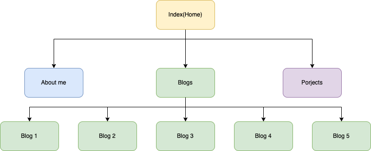

## ScreenShots

---

## Index page

---
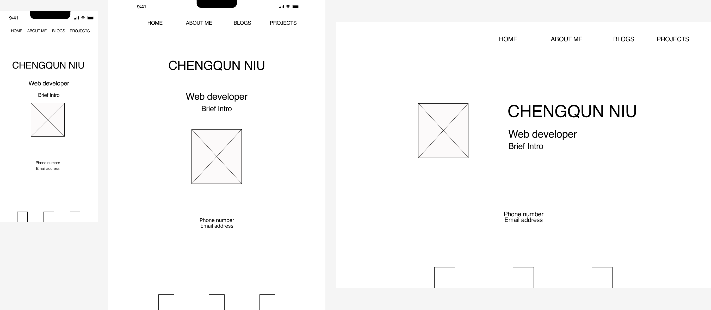
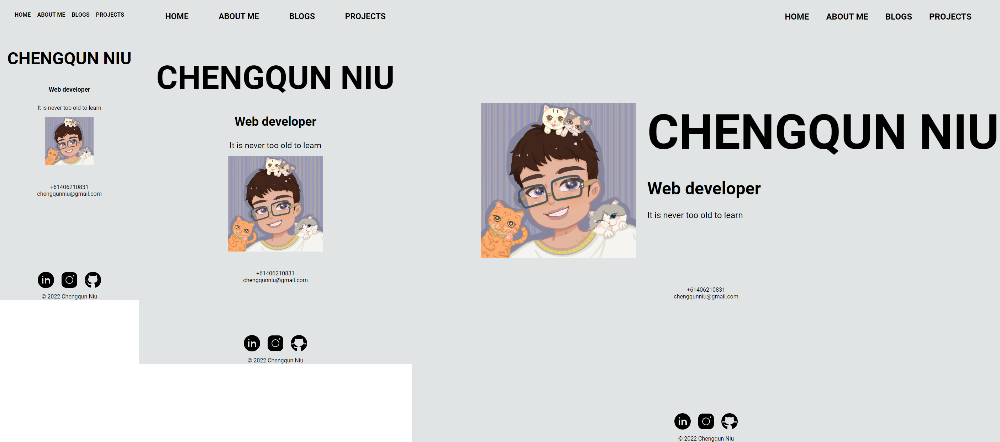

## About me page

---
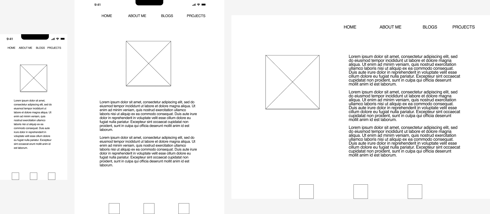
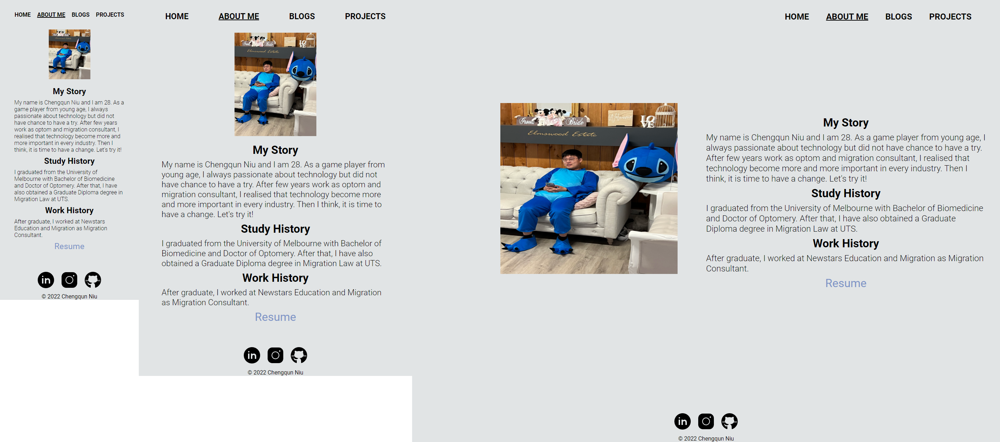

## Blogs page

---
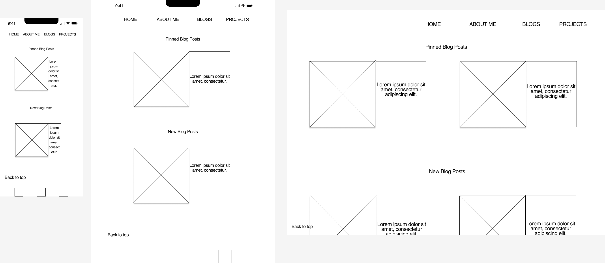
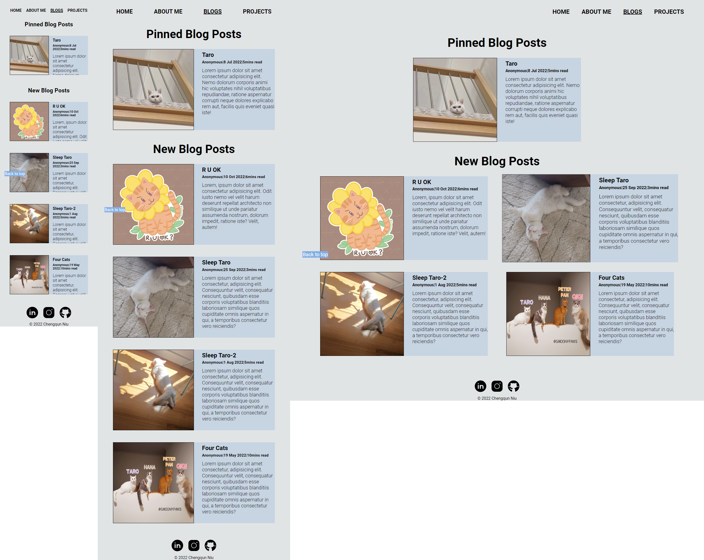

## Projects page

---
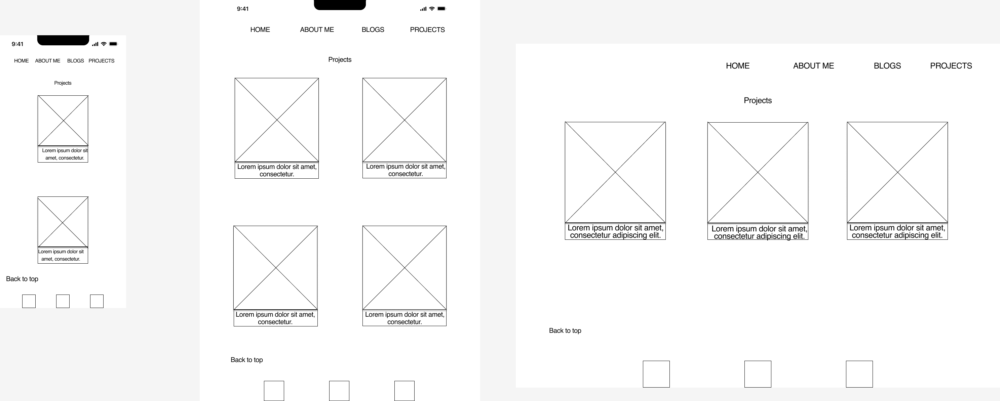
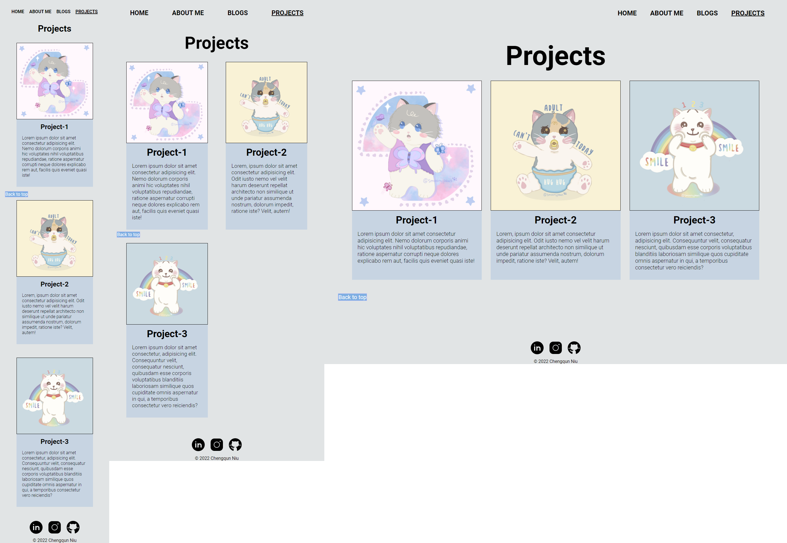

## Single Blog page

---
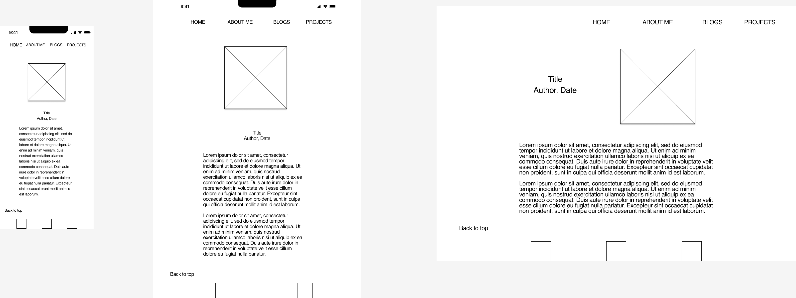
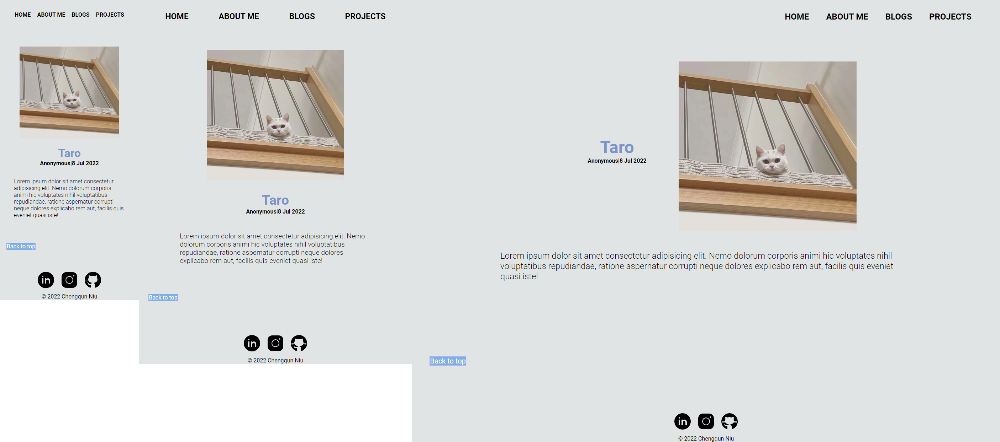

## Target Audience

---

The target audience of this portfolio is propective employers. The website is responsive to mobile, tablet and desktop to allow employers to view on different devices.

## Tech Stack

---

- Wireframe:Figma
- Sitemap: Draw.io
- Website: HTML5 and CSS
- Deployement: Netlify
